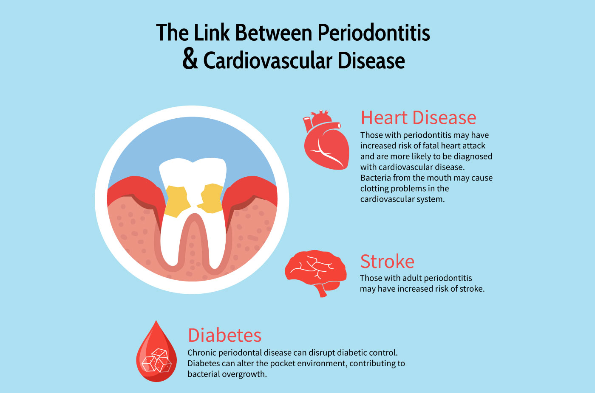

# Happy Teeth, Happy Heart!

According to the American Heart Association, oral health, especially periodontal (gum) disease is independently associated with markers of cardiovascular disease. Here, I sought to use data from the National Health and Nutrition Examination Survey to replicate these findings.

```{r, echo=FALSE, out.width="50%", fig.cap="Source: Altima Dental. (2020, July 6). Does a healthy mouth mean a healthy heart? [Infographic]. <https://www.altimadental.com/does-a-healthy-mouth-mean-a-healthy-hearrt"}


```

# 2017 - 2018 Data

NHANES data from 2019-2020 is limited access, and 2020-2023 encountered issues due to the Covid-19 Pandemic. Thus, I began by exploring the most recent dataset that included information about oral health.

```{r load}
library(nhanesA)
library(tidyverse)

demo <- nhanes('DEMO_J')
bpx  <- nhanes('BPXO_J')
hdl  <- nhanes('HDL_J')
trig <- nhanes('TRIGLY_J')
bpq  <- nhanes('BPQ_J')
smq  <- nhanes('SMQ_J')
bmx  <- nhanes('BMX_J')
ohxden <- nhanes('OHXDEN_J')

```

Note that SEQN is the participant identifier.

```{r merge}
merged <- demo %>%
  left_join(ohxden, by = "SEQN") %>%
  left_join(bpx,  by = "SEQN") %>%
  left_join(hdl,  by = "SEQN") %>%
  left_join(trig, by = "SEQN") %>%
  left_join(bpq,  by = "SEQN") %>%
  left_join(smq,  by = "SEQN") %>%
  left_join(bmx,  by = "SEQN")

nrow(merged)
ncol(merged)
```

<details>

<summary>See the code output for the head and names of the DF</summary>

```` r
```{r}
head(merged)
names(merged)
```
</details>
````

## Data Cleaning

I'm creating a new DF that only includes the variables I want to analyze.

```{r variable-selection}
# selecting the variables i want
analysis <- merged %>%
  select(
    SEQN,
    # Demographics
    RIDAGEYR,    # age
    RIAGENDR,    # sex
    RIDRETH3,    # race/ethnicity
    INDFMPIR,    # income/poverty ratio
    BMXBMI,      # BMI
    
    # Smoking
    SMQ020,      # smoked 100 cigarettes
    SMQ040,      # current smoker
    
    # Oral health tooth condition codes (TC = tooth count status)
    starts_with("OHX") & ends_with("TC"),
    
    # blood pressure
    BPXOSY1, BPXOSY2, BPXOSY3,   # systolic readings
    BPXODI1, BPXODI2, BPXODI3,   # diastolic readings
    
    # labs that are markers of heart health
    LBDHDD,   # HDL
    LBXTR,    # triglycerides
    LBDLDL,   # LDL
    
    # actually including the survey weights this time...
    WTMEC2YR, SDMVPSU, SDMVSTRA
  )


# check look + sample size 
nrow(analysis)
ncol(analysis)
```

Now I'm computing averages for the different cardiovascular health marker readings (the labs). I'm also computing the sum of teeth lost as an oral health marker.

```{r compute-averages}

analysis <- analysis %>%
  mutate(
    # average systolic and diastolic readings
    sys_avg = rowMeans(cbind(BPXOSY1, BPXOSY2, BPXOSY3), na.rm = TRUE),
    dia_avg = rowMeans(cbind(BPXODI1, BPXODI2, BPXODI3), na.rm = TRUE),

    tooth_loss = rowSums(across(starts_with("OHX") & ends_with("TC"), 
                                ~ grepl("Missing due to dental disease", ., fixed = FALSE)), 
                         na.rm = TRUE),
    
    # recoding sex and smoker status
    male = as.integer(RIAGENDR == 1),
    current_smoker = as.integer(SMQ040 == 1)
  )

# checking it worked!
summary(analysis$tooth_loss)
summary(analysis$sys_avg)

```

I'm now filtering the data (I forgot to do so earlier) to handle the missing values.

```{r filter-data}
analysis <- analysis %>%
  filter(RIDAGEYR >= 18) %>%
  filter(!is.na(sys_avg)) %>%
  filter(!is.na(tooth_loss)) %>%
  filter(!is.na(BMXBMI)) %>%
  filter(!is.na(INDFMPIR))

# checking how the filtering affects the data frame
nrow(analysis)
summary(analysis$tooth_loss)
summary(analysis$sys_avg)
```

```{r grouping}
analysis <- analysis %>%
  mutate(
    # turning tooth loss into categories
    tooth_loss_cat = cut(tooth_loss, 
                         breaks = c(-1, 0, 3, 8, 28),
                         labels = c("None (0)", "Mild (1-3)", "Moderate (4-8)", "Severe (9+)")),
    
    # hypertension flag which is systolic >= 130 or diastolic >= 80 according       to the AHA
    hypertension = as.integer(sys_avg >= 130 | dia_avg >= 80),
  
    sex = factor(RIAGENDR),
    current_smoker = as.integer(SMQ040 == 1),
    
    # turning age into categories 
    age_group = cut(RIDAGEYR, 
                    breaks = c(17, 39, 59, 79, Inf),
                    labels = c("18-39", "40-59", "60-79", "80+"))
  )

# check that it worked 
table(analysis$tooth_loss_cat)
table(analysis$hypertension)


# smoker status
table(analysis$SMQ020)  
table(analysis$SMQ040) 

analysis <- analysis %>%
  mutate(
    current_smoker = case_when(
      SMQ040 %in% c("Every day", "Some days") ~ 1,
      SMQ040 == "Not at all" ~ 0,
      SMQ020 == "No" ~ 0,
      TRUE ~ NA_real_
    )
  )

# triple check
table(analysis$current_smoker)
```

# Data Visualization

```{r}
# Tooth loss category vs. Average Systolic Blood Pressure
ggplot(analysis, aes(x = tooth_loss_cat, y = sys_avg, fill = tooth_loss_cat)) +
  geom_boxplot(alpha = 0.7) +
  labs(
    title = "Systolic Blood Pressure by Tooth Loss Severity",
    x = "Tooth Loss Category",
    y = "Average Systolic BP (mmHg)",
    fill = "Tooth Loss"
  ) +
  theme_minimal() +
  theme(legend.position = "none")
```

```{r}

# hypertension prevalence by tooth loss category
analysis %>%
  group_by(tooth_loss_cat) %>%
  summarise(hyp_rate = mean(hypertension, na.rm = TRUE)) %>%
  ggplot(aes(x = tooth_loss_cat, y = hyp_rate, fill = tooth_loss_cat)) +
  geom_col(alpha = 0.8) +
  scale_y_continuous(labels = scales::percent) +
  labs(
    title = "Hypertension Prevalence by Tooth Loss Severity",
    x = "Tooth Loss Category",
    y = "% with Hypertension",
    fill = "Tooth Loss"
  ) +
  theme_minimal() +
  theme(legend.position = "none")
```

```{r}

# Scatter plot of tooth loss vs. systolic by Age
ggplot(analysis, aes(x = tooth_loss, y = sys_avg, color = age_group)) +
  geom_point(alpha = 0.3) +
  geom_smooth(method = "lm", se = FALSE) +
  labs(
    title = "Tooth Loss vs Systolic BP by Age Group",
    x = "Number of Teeth Lost (Dental Disease)",
    y = "Average Systolic BP (mmHg)",
    color = "Age Group"
  ) +
  theme_minimal()

```

# Data Analysis

```{r}

# Model 1: crude linear regression
model_crude <- lm(sys_avg ~ tooth_loss, data = analysis)
summary(model_crude)

# Model 2: adjusted for other key factors for heart disease
model_adjusted <- lm(sys_avg ~ tooth_loss + RIDAGEYR + sex + BMXBMI + 
                       current_smoker + INDFMPIR, data = analysis)
summary(model_adjusted)

# Model 3: logistic regression for hypertension outcome
model_logistic <- glm(hypertension ~ tooth_loss + RIDAGEYR + sex + BMXBMI + 
                        current_smoker + INDFMPIR, 
                      data = analysis, family = binomial)
summary(model_logistic)

```

As we remove "confounders," tooth loss loose its significance as an independent predictor for cardiovascular disease markers (hypertension and systolic BP).

My interpretation. I tried using plot_model from the sjPlot library, but it was difficult to work with. I got help for this here:

1.  <https://interludeone.com/posts/2022-12-15-coef-plots/coef-plots>
2.  <https://ggplot2.tidyverse.org/reference/geom_linerange.html#ref-examples>

```{r}
model_partial <- lm(sys_avg ~ tooth_loss + RIDAGEYR + sex, data = analysis)

coef_data <- data.frame(
  model = c("Crude", "Partial\n(age + sex)", "Fully Adjusted"),
  estimate = c(coef(model_crude)["tooth_loss"], 
               coef(model_partial)["tooth_loss"],
               coef(model_adjusted)["tooth_loss"]),
  lower = c(confint(model_crude)["tooth_loss", 1],
            confint(model_partial)["tooth_loss", 1],
            confint(model_adjusted)["tooth_loss", 1]),
  upper = c(confint(model_crude)["tooth_loss", 2],
            confint(model_partial)["tooth_loss", 2],
            confint(model_adjusted)["tooth_loss", 2])
)

# force order on x axis
coef_data$model <- factor(coef_data$model, 
                           levels = c("Crude", "Partial\n(age + sex)", "Fully Adjusted"))

ggplot(coef_data, aes(x = model, y = estimate, color = model)) +
  geom_point(size = 4) +
  geom_errorbar(aes(ymin = lower, ymax = upper), width = 0.2, linewidth = 1) +
  geom_hline(yintercept = 0, linetype = "dashed", color = "gray50") +
  labs(
    title = "Attenuation of Tooth Loss Effect on Systolic BP",
    subtitle = "Progressive adjustment for confounders",
    x = "Model",
    y = "Coefficient (mmHg)",
    color = "Model"
  ) +
  theme_minimal() +
  theme(legend.position = "none")
```

# 2011-2012 Data

The 2017 data didn't have periodontal health, which is what's really informative. Perhaps this will explain the null results from before. So, I sought to redo my analysis, but with more information.

```{r}
demo_g  <- nhanes('DEMO_G')
ohxden_g <- nhanes('OHXDEN_G')
ohxper_g <- nhanes('OHXPER_G')  
bpx_g   <- nhanes('BPX_G')      
hdl_g   <- nhanes('HDL_G')
trig_g  <- nhanes('TRIGLY_G')
bpq_g   <- nhanes('BPQ_G')
smq_g   <- nhanes('SMQ_G')
bmx_g   <- nhanes('BMX_G')

```

## Data Cleaning

Again, SEQN is the participant identifier.

```{r}
merged_g <- demo_g %>%
  left_join(ohxden_g, by = "SEQN") %>%
  left_join(ohxper_g, by = "SEQN") %>%
  left_join(bpx_g,   by = "SEQN") %>%
  left_join(hdl_g,   by = "SEQN") %>%
  left_join(trig_g,  by = "SEQN") %>%
  left_join(bpq_g,   by = "SEQN") %>%
  left_join(smq_g,   by = "SEQN") %>%
  left_join(bmx_g,   by = "SEQN")

nrow(merged_g)
ncol(merged_g)

```

I'm repeating the cleaning steps from before.

```{r}

names(merged_g)[grepl("BPX", names(merged_g))]


merged_g <- merged_g %>%
  filter(RIDAGEYR >= 18) %>%
  mutate(
    # Average systolic and diastolic across 4 readings
    sys_avg = rowMeans(cbind(BPXSY1, BPXSY2, BPXSY3, BPXSY4), na.rm = TRUE),
    dia_avg = rowMeans(cbind(BPXDI1, BPXDI2, BPXDI3, BPXDI4), na.rm = TRUE),
    
    # Hypertension flag
    hypertension = as.integer(sys_avg >= 130 | dia_avg >= 80),
    
    # Sex, smoking, age group
    sex = factor(RIAGENDR),
    
    current_smoker = case_when(
      SMQ040 %in% c("Every day", "Some days") ~ 1,
      SMQ040 == "Not at all" ~ 0,
      SMQ020 == "No" ~ 0,
      TRUE ~ NA_real_
    ),
    
    age_group = cut(RIDAGEYR,
                    breaks = c(17, 39, 59, 79, Inf),
                    labels = c("18-39", "40-59", "60-79", "80+"))
  )

summary(merged_g$sys_avg)
```

I found some strange values in the summary above. I realized I needed to remove the missing values.

```{r}
# weird values check
summary(merged_g$perio_severity)

# remove the NA stuff
merged_g <- merged_g %>%
  mutate(
    perio_severity = rowMeans(
      select(., matches("OHX\\d+PCD|OHX\\d+PCM|OHX\\d+PCS|OHX\\d+PCP|OHX\\d+PCL|OHX\\d+PCA")) %>%
        mutate(across(everything(), ~ ifelse(. >= 99 | . == 0, NA, .))),
      na.rm = TRUE
    ),
    
    perio_cat = cut(perio_severity,
                    breaks = c(0, 2, 3, 4, Inf),
                    labels = c("Healthy", "Mild", "Moderate", "Severe"))
  )

summary(merged_g$perio_severity)
table(merged_g$perio_cat)

# filter like I did in previous year 
analysis_g <- merged_g %>%
  filter(!is.na(sys_avg)) %>%
  filter(!is.na(perio_severity)) %>%
  filter(!is.na(BMXBMI)) %>%
  filter(!is.na(INDFMPIR)) %>%
  filter(!is.na(current_smoker))

nrow(analysis_g)
summary(analysis_g$perio_severity)

table(analysis_g$perio_cat)

#not enough in severe group so merge
analysis_g <- analysis_g %>%
  mutate(
    perio_cat = cut(perio_severity,
                    breaks = c(0, 1.5, 2, Inf),
                    labels = c("Healthy", "Mild", "Moderate/Severe"))
  )

table(analysis_g$perio_cat)

```

## Data Analysis

```{r}

# Crude
model_crude_g <- lm(sys_avg ~ perio_severity, data = analysis_g)
summary(model_crude_g)

# Adjusted
model_adjusted_g <- lm(sys_avg ~ perio_severity + RIDAGEYR + sex + BMXBMI + 
                          current_smoker + INDFMPIR, data = analysis_g)
summary(model_adjusted_g)

# Logistic
model_logistic_g <- glm(hypertension ~ perio_severity + RIDAGEYR + sex + BMXBMI + 
                           current_smoker + INDFMPIR, 
                         data = analysis_g, family = binomial)
summary(model_logistic_g)


```

# Comparison of Oral vs Gum Health Models

```{r}

# comparison
comparison <- data.frame(
  analysis = c("Crude\n(Tooth Loss)", "Adjusted\n(Tooth Loss)", 
                "Crude\n(Pocket Depth)", "Adjusted\n(Pocket Depth)"),
  estimate = c(coef(model_crude)["tooth_loss"],
               coef(model_adjusted)["tooth_loss"],
               coef(model_crude_g)["perio_severity"],
               coef(model_adjusted_g)["perio_severity"]),
  lower = c(confint(model_crude)["tooth_loss", 1],
            confint(model_adjusted)["tooth_loss", 1],
            confint(model_crude_g)["perio_severity", 1],
            confint(model_adjusted_g)["perio_severity", 1]),
  upper = c(confint(model_crude)["tooth_loss", 2],
            confint(model_adjusted)["tooth_loss", 2],
            confint(model_crude_g)["perio_severity", 2],
            confint(model_adjusted_g)["perio_severity", 2]),
  measure = c("Tooth Loss", "Tooth Loss", "Pocket Depth", "Pocket Depth")
)

comparison$analysis <- factor(comparison$analysis, levels = comparison$analysis)

ggplot(comparison, aes(x = analysis, y = estimate, color = measure)) +
  geom_point(size = 4) +
  geom_errorbar(aes(ymin = lower, ymax = upper), width = 0.2, linewidth = 1) +
  geom_hline(yintercept = 0, linetype = "dashed", color = "gray50") +
  labs(
    title = "Oral Health & Systolic BP: Measurement Quality Matters",
    subtitle = "Crude vs adjusted effects across two exposure measures",
    x = NULL,
    y = "Coefficient (mmHg)",
    color = "Exposure"
  ) +
  theme_minimal()


```

# COOL PLOTS

```{r}
library(ggcorrplot)
cor_vars <- analysis_g %>% 
  select(perio_severity, sys_avg, dia_avg, BMXBMI, RIDAGEYR, INDFMPIR) %>%
  cor(use = "complete.obs")
ggcorrplot(cor_vars, lab = TRUE)

```

```{r}
library(ggridges)
ggplot(analysis_g, aes(x = sys_avg, y = perio_cat, fill = perio_cat)) +
  geom_density_ridges(alpha = 0.7) +
  theme_minimal()

```

```{r}
ggplot(analysis_g, aes(x = perio_severity, y = sys_avg, color = age_group)) +
  geom_smooth(method = "lm", se = TRUE) +
  facet_wrap(~ sex) +
  theme_minimal()

```

### INFORMATION REGARDING THE NHANES DATASET

Centers for Disease Control and Prevention (CDC). National Center for Health Statistics (NCHS). National Health and Nutrition Examination Survey Data. Hyattsville, MD: U.S. Department of Health and Human Services, Centers for Disease Control and Prevention, [2026][<https://www.cdc.gov/nchs/nhanes/about/>].
